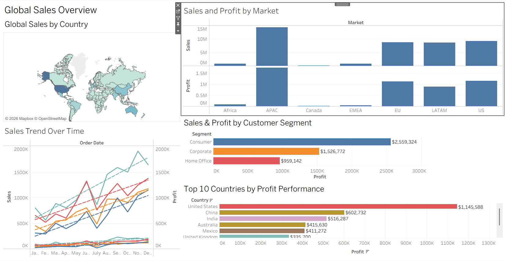
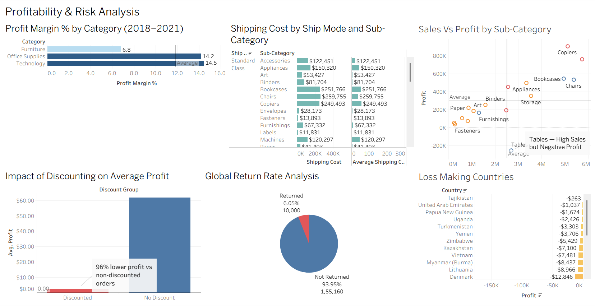
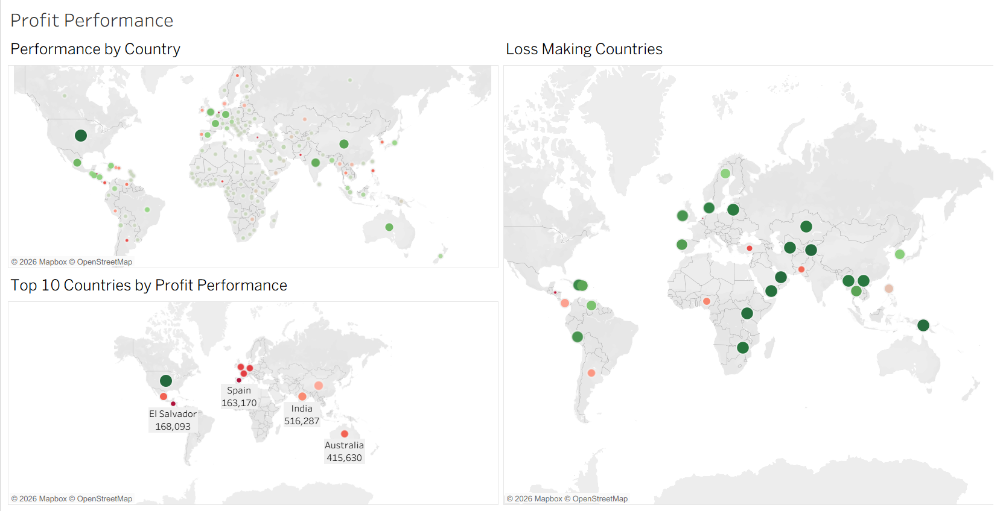

# Global Market Performance Analytics
Global retail analytics project using Tableau and Excel — analyzing sales, profit margins, discount impact, and return rates across 7 international markets

## Project Overview
Analyzed 51,290 global order records across 147 countries 
and 7 markets spanning 2018-2021 using Tableau and Excel
to uncover sales, profit, and market performance insights.

## Tools Used
- Tableau Desktop
- Microsoft Excel
- Tableau Public

## Key Findings
- APAC highest performing market — $3.5M sales, $436K profit
- Discounted orders generated 96% lower average profit 
  ($2.65) vs non-discounted orders ($61.72)
- Furniture category generated only 7% profit margin 
  vs 14% for Technology and Office Supplies
- Tables sub-category identified as loss maker despite 
  high sales volume
- 19.5% global return rate identified across all markets

## Dashboard Link
[View Live Dashboard](https://public.tableau.com/app/profile/sreeja.vankayalapati/viz/GlobalMarketPerformanceAnalytics/D1)

## Dashboard Screenshots

### Dashboard 1 - Global Sales Overview

### Dashboard 2 - Profitability & Risk Analysis

### Dashboard 3 - Country Profit Performance

